- Naam: Arno Verhulst
- GitHub repo: https://github.com/HoGentTIN/infra-2526-vharno1612
- Nieuwe GitHub repo: https://github.com/vharno1612/labo-1-infra-auto.git


## 1.1 Set up the lab environment

- Ga naar folder -> `cd`

- Boot de vm -> `vagrant up`

- Verbind met vm -> `vagrant ssh dockerlab`

- Runt er al een Portainer container? -> `sudo docker ps`

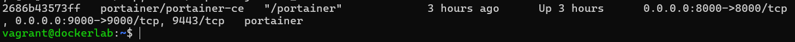

- Surf naar -> <http://192.168.56.20:9000/>


## 1.1 Git configuren

- `git config --global --list` om te kijken of `user.name` en `user.email` ingesteld zijn.

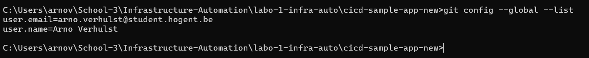

- Kopieer de inhoud van `cicd-sample-app` naar een nieuwe directory buiten de huidige git directory.

- Initialiseer een git repo met `git init` en commit alle code.

- Link je local repo met degene die je net gemaakt hebt `git remote add origin git@github.com:USER/cicd-sample-app.git`.

- Push de local committed code naar Github met het commando `git push -u origin main`

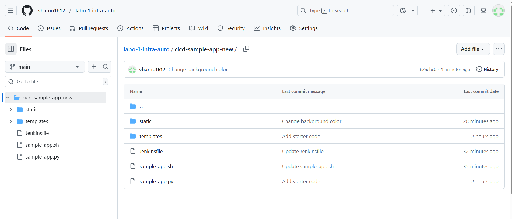

## 1.2 Build and verify the sample application

- Verbind met vm -> `vagrant ssh dockerlab`

- Ga naar de directory `/vagrant/cicd-sample-app` -> `cd`

- Run het script sample-app.shh met het commando `./sample-app.sh`

- Surf naar om te verifiëren of de app runt <http://192.168.56.20:5050/>

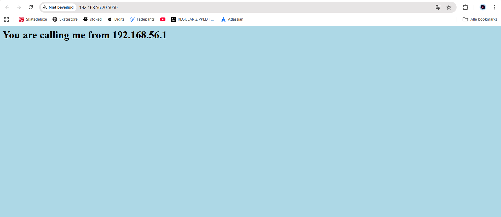

- Stop en verwijder samplerunning container met de commandos `docker stop samplerunning` & `docker rm samplerunning`


## 1.3 Download and run the Jenkins Docker image

- Download de Jenkins image met het commando `docker pull jenkins/jenkins:lts`

- Start Jenkins met:
  
 ```console
    docker run -p 8080:8080 -u root \
      -v jenkins-data:/var/jenkins_home \
      -v $(which docker):/usr/bin/docker \
      -v /var/run/docker.sock:/var/run/docker.sock \
      -v "$HOME":/home \
      --name jenkins_server jenkins/jenkins:lts
 ```

- Password: fb49a161606a405d89db56cf418c1c80

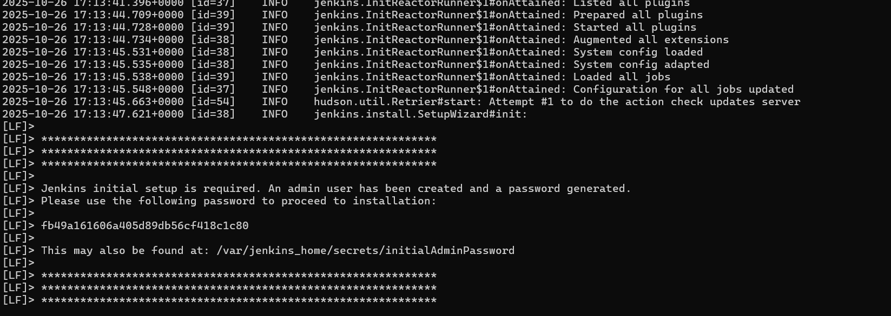


## 1.4 Configure Jenkins

- Surf naar <http://192.168.56.20:8080/>, vul het verkregen admin wachtwoord in.
  
- Kies voor de recommended plugins en wacht tot Jenkins geïnitialiseerd is

- Na de initialisatie vraagt men om een admin aanmaken, klik op de knop "skip and continue as admin"

- Bij de volgende pagina "Instance Configuration" klik je op de knop "Save and Finish"

- Klik daarna op de knop "Start using Jenkins"


## 1.5 Use Jenkins to build your application

- Klik "create a new job" en geef een gepaste naam in (BuildSampleApp) en selecteer "free style object" als job type.

- Ga naar de sectie "Source Code Management" en selecteer de radio button "Git" en geef de https-URL naar je GitHub project in `https://github.com/vharno1612/labo-1-infra-auto.git`

- Kies bij "branches to be build" voor de optie "*/main"

- Ga naar de sectie "Build Steps" en klik op "Add Build Step" en selecteer "Execute Shell" van de dropdown lijst

- Geef de code `cd cicd-sample-app-new` en `bash ./sample-app.sh` in en klik op "Save"

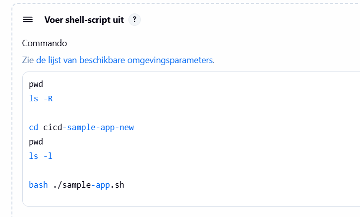

- Je bent op het dashbord pagina van Jenkins, klik op de job die hebt gemaakt en klik daarna op "Build Now"

- Mogelijke foutboodschap is dat er al een container met dezelfde naam draait, verwijder deze en probeer opnieuw
  
- Reload de browser tab om te kijken of de sample applicatie aan het runnen is

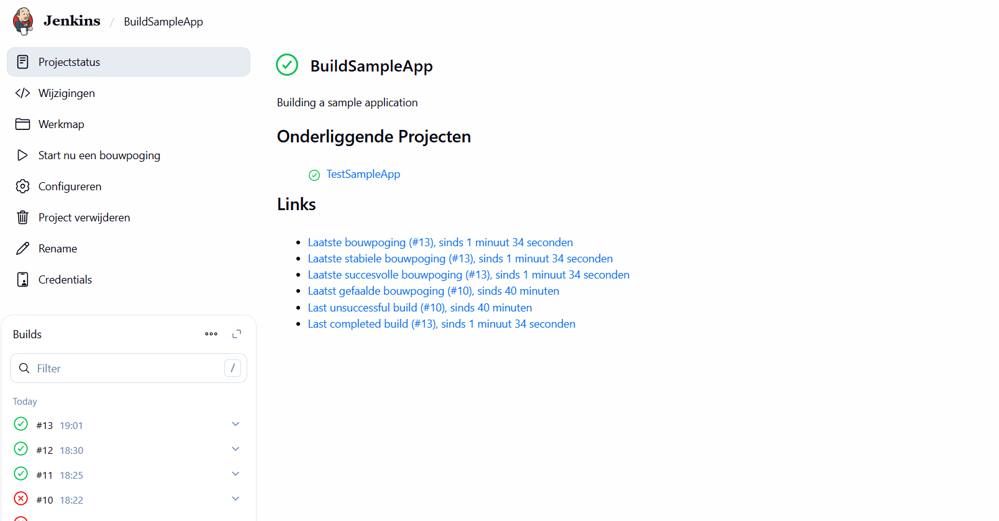


## 1.6 Add a job to test the application

IP adres vinden voor sampleapp en jenkins_server met het commando:
- `docker inspect -f '{{range .NetworkSettings.Networks}}{{.IPAddress}}{{end}}' samplerunning` voor sampleapp container
- `docker inspect -f '{{range .NetworkSettings.Networks}}{{.IPAddress}}{{end}}' jenkins_server` voor jenkins container

- Samplerunning:  172.17.0.3
- Jenkins:      172.17.0.2

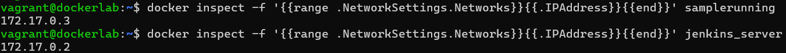

- Kijk of de app beschikbaar is met het commando `curl http://172.17.0.3:5050/`

- Je zou volgende output moeten zien:

    ```text
     <h1>You are calling me from 172.17.0.1</h1>
    ```

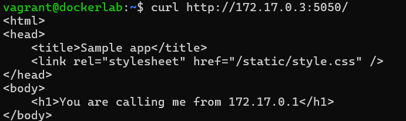

- Klik op "create a new job" en geef het een gepaste naam (TestSampleApp)

- Selecteer "free style project" als job type en druk op de knop "OK"

- Ga naar de sectie "Build Triggers" en selecteer de checkbox "Build after other projects are built"

- Vul in het veld "Projects to watch" de naam in van je build job (BuildSampleApp)

- Ga naar de sectie "Build Steps" en kies voor een build step van het type "Execute Shell"

- Geef volgende code in:

    ```text
    #!/bin/bash
    response=$(curl -s http://172.17.0.3:5050/)  
    printf "%s\n" "$response"  
    printf "%s\n" "$response" | grep "You are calling me from 172.17.0.2" 
    ```

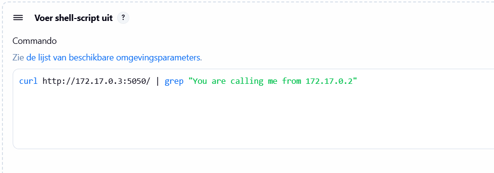

- Save en run de job om te verifiëeren of het werkt.

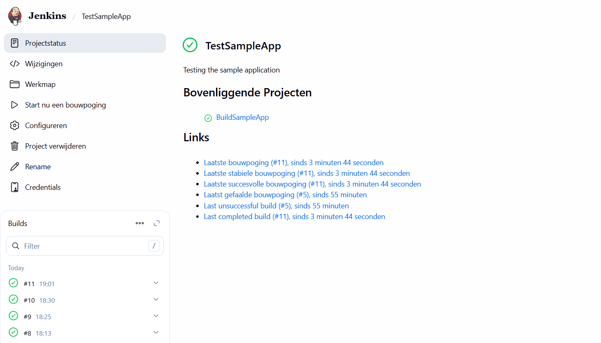

- Stop en verwijder de `samplerunning` container en launch de build job.


## 1.7 Create a build pipeline 

- Klik bij het dashbord op "Create New Item"

- Geef een gepaste naam in (bv. SampleAppPipeline) en selecteer "Pipeline" als job type

- Ga naar de sectie "Pipeline" en zet volgende code in het tekstveld:

     ```text
    node {
        stage('Preparation') {
            catchError(buildResult: 'SUCCESS') {
                sh 'docker stop samplerunning'
                sh 'docker rm samplerunning'
            }
        }
        stage('Build') {
            build 'BuildSampleApp'
        }
        stage('Results') {
            build 'TestSampleApp'
        }
    }

    ```

- Start de build door op het groene icoon naast de build te klikken

- Check de console output voor elke fase

- Open de browser tab om te verifiëren dat de app runt


## 1.8 Use a Jenkinsfile

- Automatiseer de configuratie van de buildpipeline door een `Jenkinsfile` toe te voegen aan de root van de applicatie Git repository

- Verwijder de pipeline van het Jenkins dashbord

- Create een nieuwe pipeline voor de Git repository:
    - klik op "Create new Item"
    - geef een gepaste naam in (bv. SampleAppPipeline)
    - kies voor "Pipeline" als job type
    - ga naar de sectie "Pipeline" en kies voor de optie "Pipeline script from CSM" bij "Definition"
    - kies voor "Git" bij "CSM" en geef de URL van je GitHub repository in
    - kies voor de main branch bij "Branch specifier" e, druk op de knop "Save"

- Verifiëer of alles correct runt

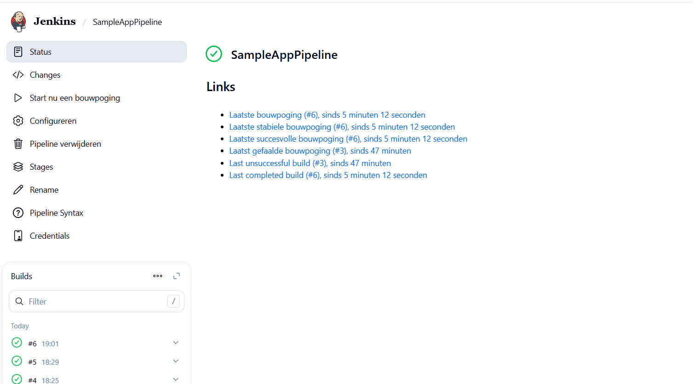


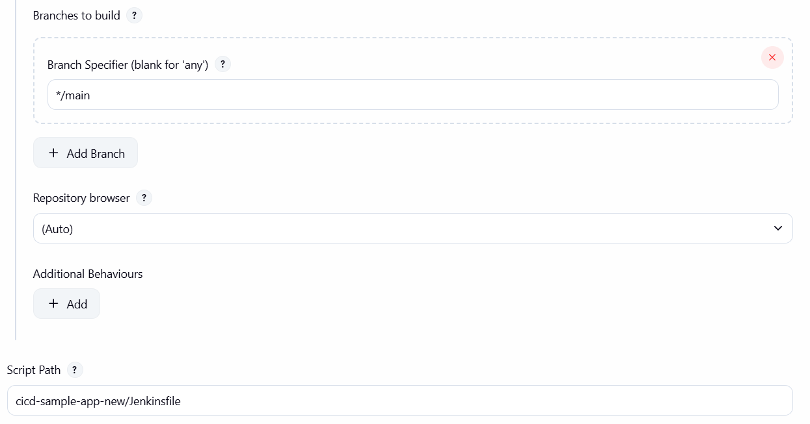

## 1.9 Make a change in the application

- Ga naar je local copy van de Git repository van de applicatie en open het bestand `static/style.css`

- Verander de achtergrond kleur

- Save het bestand, commit je veranderingen en push het naar github

- Launch de build pipeline op het Jenkins dashbord

- Herlaad de applicatie in de browser, deze moet een andere achtergrond kleur krijgen

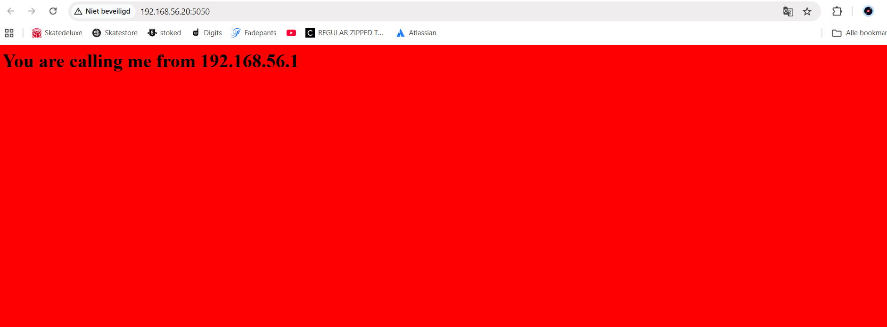

## Cheatsheet
| Task                                           | Command                                                                                          |
| :---                                           | :---                                                                                             |
| git configuratie bekijken                      | `git config --global --list`                                                                     |
| bestanden toevoegen om te committen            | `git add FILE...`                                                                                |
| changes committen naar local repository        | `git commit -m 'MESSAGE'`                                                                        |
| local changes pushen naar remote repository    | `git push`                                                                                       |
| changes van remote repo naar local repo pullen | `git pull`                                                                                       |
| docker container stoppen                       | `docker stop ...`                                                                                |
| docker container verwijderen                   | `docker rm ...`                                                                                  |
| docker containers bekijken                     | `docker ps`                                                                                      |
| ip adres van een container achterhalen         | `docker inspect -f '{{range .NetworkSettings.Networks}}{{.IPAddress}}{{end}}' samplerunning ...` |
| docker installeren                             | `docker pull jenkins/jenkins:lts`                                                                |
| virtuele machine booten met vagrant            | `vagrant up  ...`                                                                                |
| verbinden met virtuele machine met vagrant     | `vagrant up  ...`                                                                                |


## bronnen

- https://www.youtube.com/watch?v=pMO26j2OUME&list=PLy7NrYWoggjw_LIiDK1LXdNN82uYuuuiC&index=1

- https://www.linkedin.com/learning/learning-jenkins-14423877/install-jenkins-as-a-container?resume=false&u=121303466
